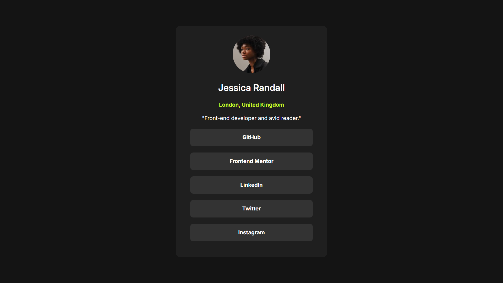
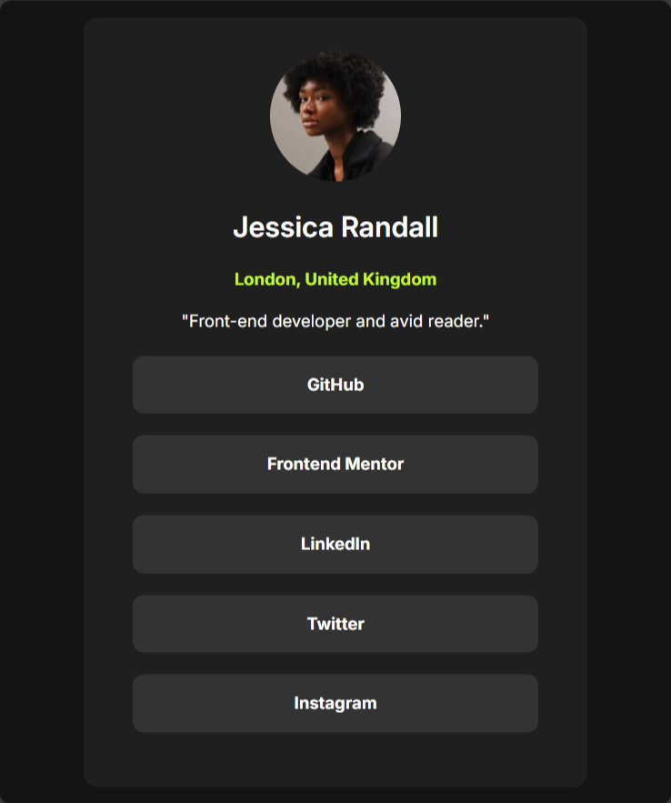

# Frontend Mentor - Blog preview card solution

This is a solution to the [Social links profile challenge on Frontend Mentor](https://www.frontendmentor.io/challenges/social-links-profile-UG32l9m6dQ). Frontend Mentor challenges help you improve your coding skills by building realistic projects.

## Table of contents

- [Overview](#overview)
  - [Screenshot](#screenshot)
  - [Links](#links)
- [My process](#my-process)
  - [Built with](#built-with)
  - [What I learned](#what-i-learned)
  - [Continued development](#continued-development)
  - [Useful resources](#useful-resources)
- [Author](#author)

## Overview

### Screenshot

Look at how I have completed this challenge, first in the desktop version:

Expectation:

Reality:

Then, in the mobile version:

Expectation:

Reality:

### Links

- Solution URL: [https://github.com/Thomas-Brito/Social-links-profile](https://github.com/Thomas-Brito/Social-links-profile)
- Live Site URL: [https://thomas-brito.github.io/Social-links-profile/](https://thomas-brito.github.io/Social-links-profile/)

## My process

### Built with

- Semantic HTML5 markup
- CSS custom properties

### What I learned

I learned that we can fastly complete a challange when use correct resources, like HTML semantic tags, CSS reutilizable styles and CSS at-rules and function.

### Continued development

I intend to continue increasing my knowledge in HTML and CSS, and add to this the knowledge about other important resources, like SASS, Bootstrap, JS e Svelt.

### Useful resources

- [W3Schools.com](https://www.w3schools.com/) - This helped me remember how and when to use certain tags in HTML and certain properties in CSS.

## Author

- Frontend Mentor - [@Thomas-Brito](https://www.frontendmentor.io/profile/Thomas-Brito)